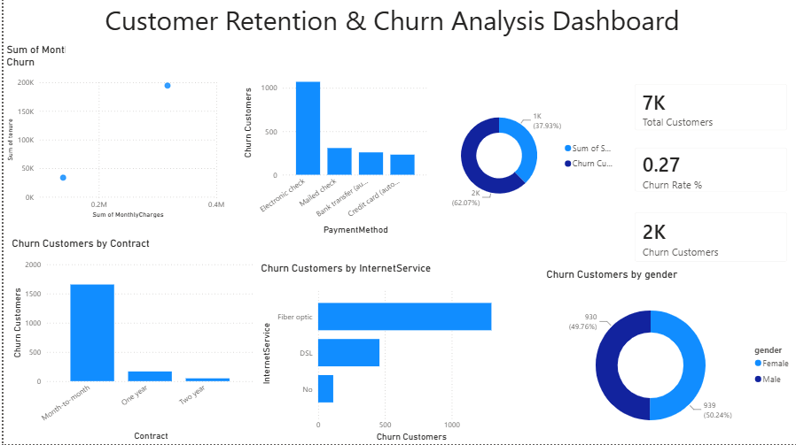

# Future Interns Task 2 - Customer Churn Analysis Dashboard

## Objective
Analyze telecom customer churn patterns using Power BI and identify factors influencing customer retention.

## Tools Used
- Power BI
- DAX
- Data Visualization

## KPIs
- Total Customers: 7043
- Churn Customers: 1869
- Churn Rate: 27%

## Key Insights
- Month-to-month contracts have the highest churn.
- Fiber optic customers show higher churn.
- Electronic check users are more likely to churn.
- Churn distribution is nearly equal across genders.

## Dashboard Preview

